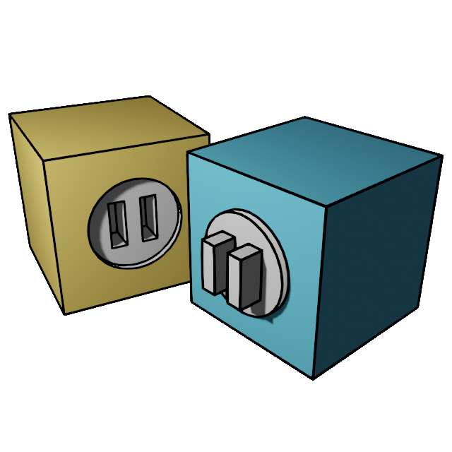

# 3D Tile Tools for Godot

 - Use Blender to cut a scene into 3D tiles
 - Import into Godot to generate 3D maps

## Exporting from Blender, Importing to Godot

Before the demo will run, you'll need to:

In **Blender**:
1. Open `CRWTILES_demo/resources/tiles.blend`
    - *Note: I'm stuck at Blender 2.93.18, for now*
2. Add the crwtiles Blender addon at `/blender/crwtiles`
    - This will add a "3D Tile" tool for the 3D view
3. Open the "3D Tile" tab:
    - Click "Generate Tiles"
    - Click "Export Tiles"

In **Godot**:
1. Enable the CRWTILES plugin
2. Create a Resource file (CRWTILES_TileAtlasResource): `CRWTILES_demo/resources/exports/crwtiles/tile_library.tres`
3. Double click the new resource in the FileSystem panel
4. Set the Scene File to the file exported by Blender (`CRWTILES_demo/resources/exports/crwtiles/tile_library.glb`)
5. Click "Import" in the Inspector dock (underneath the CRWTILES_TileAtlasResource heading)

---
I want this to empower your projects, not become someone else’s product. This library is free to use in your projects, but please don’t redistribute it standalone.

